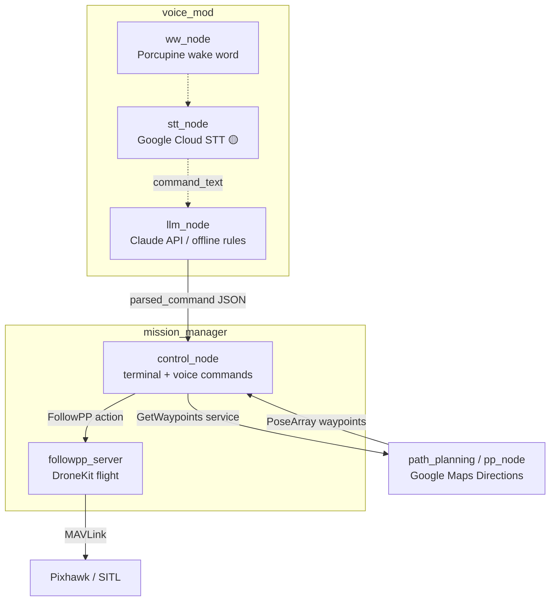

# D-Guide 🛸

**A voice-commanded guide drone that plans real street routes and leads you there.**

Tell the drone where you want to go. It geocodes the destination, pulls
walking directions from Google Maps, converts every turn into GPS waypoints,
takes off, and flies the route ahead of you — built on ROS 2 as a set of
loosely-coupled nodes (service + action architecture), running on a Raspberry
Pi companion computer with a Pixhawk flight controller, and fully testable
with no hardware in SITL.

<!-- Demo GIF: record a SITL mission (see docs/SITL.md) and drop it here -->
<!--  -->

## Features

| Status | Feature |
|---|---|
| ✅ Implemented | **Street-level path planning** — address → Google Maps Directions → GPS waypoint list, exposed as a ROS 2 service |
| ✅ Implemented | **Waypoint-following flight** — ROS 2 action server flies the route via MAVLink (DroneKit): arm → takeoff → follow → land, with live progress feedback |
| ✅ Implemented | **Mission orchestration** — interactive control node wires user input → path service → flight action |
| ✅ Implemented | **SITL support** — the same code flies a simulated drone (`DRONE_CONNECTION` env var, [guide](docs/SITL.md)) or a real Pixhawk |
| ✅ Implemented | **LLM command parsing** — natural language ("take me to the library") → structured intent via the Claude API, with an offline rule-based fallback |
| 🟡 WIP | **Voice pipeline** — Porcupine wake-word detection nodes and Google Cloud STT; not yet wired end-to-end into the mission flow |
| 📋 Planned | **HOLO-DWA obstacle avoidance** — LiDAR-driven reactive avoidance; algorithm already built and validated in the companion repo ([design doc](docs/HOLO-DWA.md)) |

## Architecture



Full node/topic/service reference: [docs/architecture.md](docs/architecture.md)

## Tech Stack

**ROS 2 Humble** (rclpy, custom srv/action interfaces) · **DroneKit / pymavlink**
(MAVLink flight control) · **Google Maps Platform** (Geocoding + Directions) ·
**Claude API** (command parsing) · **Picovoice Porcupine** (wake word) ·
**Google Cloud Speech-to-Text** · **ArduPilot / PX4 SITL** · **Docker**

## Quick Start

### Prerequisites

- Ubuntu 22.04 + [ROS 2 Humble](https://docs.ros.org/en/humble/Installation.html)
- Python 3.10, then `pip install -r requirements.txt`
- A [Google Maps API key](https://console.cloud.google.com/google/maps-apis)
  (Geocoding + Directions enabled)

### 1. Configure secrets

```bash
cp .env.example .env
# edit .env — GOOGLE_MAPS_API_KEY is required; the rest are optional
```

`.env` is gitignored; nothing secret ever enters the repo.

### 2. Start a simulated drone (no hardware needed)

Follow [docs/SITL.md](docs/SITL.md) to launch ArduPilot SITL. The default
`DRONE_CONNECTION=tcp:127.0.0.1:5760` already points at it.
(Real Pixhawk instead: set `DRONE_CONNECTION=/dev/ttyACM0` in `.env`.)

### 3. Build and fly

```bash
cd ros_ws
./bringup.sh
```

`bringup.sh` loads `.env`, builds with colcon, starts the path-planning
service and flight action server, then drops you into the control node:

```
Enter origin: Hukou Station
Enter destination: <your destination>
```

The drone takes off, follows the street route waypoint by waypoint, and lands.

### 4. Optional: natural-language commands

```bash
ros2 run voice_mod llm_node   # separate terminal, after source install/setup.bash
ros2 topic pub --once /command_text std_msgs/String \
  "{data: 'take me from Hukou Station to the city library'}"
```

With `ANTHROPIC_API_KEY` set, parsing uses the Claude API; without it, an
offline rule-based parser handles the common phrasings — the demo works
key-free.

### Docker

```bash
docker compose -f docker/docker-compose.yml up --build -d
docker compose -f docker/docker-compose.yml exec dguide bash
```

Host networking is enabled so the container reaches SITL on the host.

## Repository Layout

```
├── docs/                 # architecture, SITL guide, HOLO-DWA design
├── docker/               # ROS 2 Humble container for the nav stack
└── ros_ws/
    ├── bringup.sh        # one-shot build + launch
    ├── scripts/          # standalone tools (flight smoke test, waypoint CLI)
    └── src/
        ├── interfaces/       # GetWaypoints.srv, FollowPP.action
        ├── path_planning/    # Google Maps → waypoints service
        ├── mission_manager/  # control_node + followpp_server
        └── voice_mod/        # wake word, STT, LLM parsing
```

## Roadmap

- [ ] Integrate [HOLO-DWA](https://github.com/blar-tw/HOLO-DWA) obstacle
      avoidance as an `obstacle_avoidance` package ([design](docs/HOLO-DWA.md))
- [ ] Wire the voice pipeline end-to-end (wake word → STT → llm_node)
- [ ] Record a SITL demo GIF for this README
- [ ] Altitude profile from terrain elevation data
- [ ] On-drone TTS feedback to the user

## Companion Project

**[HOLO-DWA](https://github.com/blar-tw/HOLO-DWA)** — holonomic Dynamic Window
Approach obstacle avoidance for multirotors (PX4 SITL + Gazebo), built and
tuned to 15/15 goal-reaching runs with zero collisions. It is the avoidance
layer on this project's roadmap.

## License

[MIT](LICENSE)
