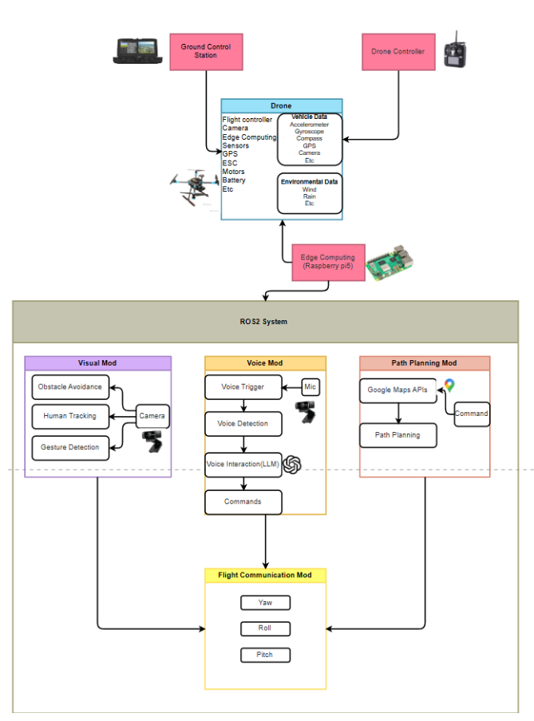
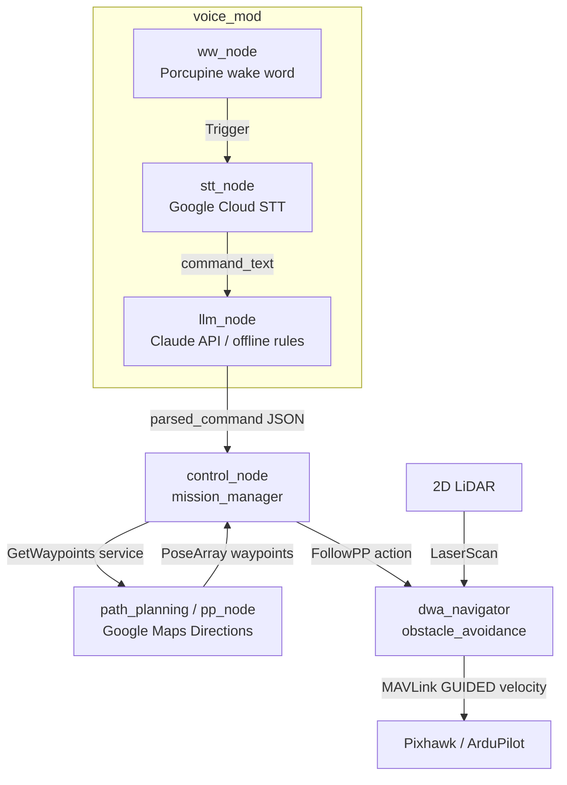

# D-Guide

**Drone Guide, a voice-commanded guide drone that plans real street routes and leads you there.**

Tell the drone where you want to go. It geocodes the destination, pulls
walking directions from Google Maps, converts every turn into GPS waypoints,
takes off, and flies the route ahead of you.

## Demo
WIP

## Overview

D-Guide is a physical, airborne navigation assistant. Instead of staring at a
2D map on a phone, you simply follow a drone that flies ahead and leads you to
your destination. It combines Google Maps route data, onboard obstacle
avoidance, and voice + language-model interaction, all integrated on ROS 2.

The aim is navigation that needs no map-reading and no sense of direction — you
just follow the drone. That makes it useful for children, older adults,
visitors in unfamiliar places, and anyone for whom looking down at a phone is
unsafe or impractical.

## Motivation

Phone navigation apps are feature-complete but carry real drawbacks: looking
down at a screen while walking causes accidents, the interface assumes
map-reading skill, and a flat 2D view gives poor, non-real-time guidance in
unfamiliar or complex environments. D-Guide replaces the screen with a physical
guide you can just follow.

What makes D-Guide worthwhile:

- **Safety** — no looking down at a phone while walking.
- **Precision** — a physical guide you follow in the real world.
- **Extensibility** — we aim to build a helper that is not only your eyes and ears, but eventually understands what you need.

## Use Cases

- **Guided navigation** for children, older adults, or anyone unfamiliar with map apps
- **Museum / campus tours** — lead visitors around, narrate exhibits
- **Marathon / route guidance** — keep runners on the correct course
- **Low-vision assistance** — paired with the voice system for more freedom of movement

## Features

- **Path Planning** — address → Google Maps Directions → GPS waypoint list, exposed as a ROS 2 service. Suitable for street-level planning and finding the best route to the destination.
- **Obstacle Avoidance** — holonomic Dynamic Window Approach, a LiDAR-driven reactive flight: each waypoint is flown under closed-loop velocity control, re-planning around obstacles at ~10 Hz (source: holo-dwa).
- **Person following / pacing** — YOLO-based tracking to match the user's walking speed.
- **Hand gesture control** — fly commands via simple hand gestures (MediaPipe) (WIP).
- **Voice pipeline** — Porcupine wake word → Google Cloud STT → command text → LLM command parsing into a structured intent via the Claude API, with an offline rule-based fallback.
- **Mission orchestration** — control node wires typed/spoken input → path service → avoidance flight action.

## Hardware

Built on a Holybro X500 V2 quad-frame with a Raspberry Pi companion computer
and a Pixhawk flight controller; 3D-printed mounts carry the LiDAR and camera,
and any part can be swapped or added.

| Component | Part | Purpose |
|---|---|---|
| Airframe | Holybro X500 V2 | Stable quad platform with room to mod |
| Companion computer | Raspberry Pi 5 | Onboard compute — low power, strong community support |
| Flight controller | Pixhawk 6C | Flight control (STM32H743, vibration isolation) |
| Range sensor | 2D LiDAR | Obstacle avoidance (HOLO-DWA) |
| Camera | Logitech C922 Pro | Vision input (gestures / person tracking) |

## Software Architecture

Note: the LiDAR feeds directly into the obstacle-avoidance node.

The precise node / topic / service wiring (matches the ROS 2 code):

Full node/topic/service reference: [docs/architecture.md](docs/architecture.md)

## How It Works

### 1. Path planning (Google Maps)

Address → **Geocoding API** (lat/lng) → **Directions API** (walking route) →
resampled into a dense list of GPS waypoints → handed to the flight controller
over MAVLink (DroneKit / pymavlink). The **Elevation API** can optionally set a
safe cruise altitude.

### 2. Obstacle avoidance (LiDAR + HOLO-DWA)

A 2D LiDAR feeds the HOLO-DWA planner, which flies each waypoint under
closed-loop velocity control and re-plans around obstacles at ~10 Hz. (The
original design used camera-only YOLO avoidance; the shipped system uses LiDAR
for reliability.)

### 3. Person following / pacing

A camera-based YOLO tracker detects the user and adjusts the drone's speed to
match their walking pace, so the guide stays ahead without leaving them behind.

### 4. Voice & language

Porcupine wake word → Google Cloud Speech-to-Text → command text → the Claude
API parses the natural-language request into a structured intent, with an
offline rule-based fallback when no key is set.

### 5. ROS 2 integration

Every module is a ROS 2 node communicating over topics / services / actions, so
avoidance, planning, and voice run independently and are easy to debug and
extend.

## Tech Stack

**ROS 2 Humble** (rclpy, custom srv/action interfaces) · **ArduPilot** (Pixhawk,
GUIDED velocity control) · **DroneKit / pymavlink** (MAVLink) · **2D LiDAR**
(`sensor_msgs/LaserScan`) · **NumPy** (vectorized DWA search) · **Google Maps
Platform** (Geocoding + Directions) · **Claude API** (command parsing) ·
**Picovoice Porcupine** (wake word) · **Google Cloud Speech-to-Text** · **Docker**

## Installation

See [installation.md](installation.md) for setup and dependency instructions.

## References

- [Google Maps Platform](https://developers.google.com/maps)
- [Holybro X500 V2](https://holybro.com/collections/multicopter-kit/products/x500-v2-kits)
- [ROS 2 Documentation](https://docs.ros.org/)
- [Picovoice Porcupine](https://picovoice.ai/platform/porcupine/)
- [MediaPipe Gesture Recognizer](https://ai.google.dev/edge/mediapipe/solutions/vision/gesture_recognizer)
- [Ultralytics YOLO](https://docs.ultralytics.com/) 
