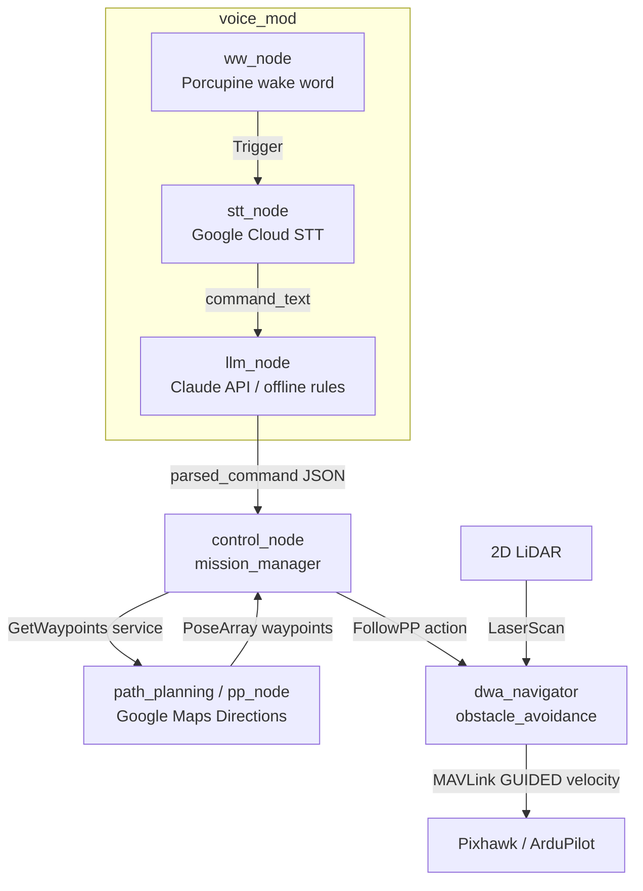

# D-Guide

**A voice-commanded guide drone that plans real street routes and leads you there.**

Tell the drone where you want to go. It geocodes the destination, pulls
walking directions from Google Maps, converts every turn into GPS waypoints,
takes off, and flies the route ahead of you.

<!-- Demo GIF: record a SITL mission (see docs/installation.md) and drop it here -->
<!--  -->

## Overview

D-Guide is a physical, airborne navigation assistant. Instead of staring at a
2D map on a phone, you simply follow a drone that flies ahead and leads you to
your destination. It combines Google Maps route data, onboard obstacle
avoidance, and voice + language-model interaction, all integrated on ROS 2.

The aim is navigation that needs no map-reading and no sense of direction — you
just follow the drone. That makes it useful for children, older adults,
visitors in unfamiliar places, and anyone for whom looking down at a phone is
unsafe or impractical.

## Motivation

Phone navigation apps are feature-complete but carry real drawbacks: looking
down at a screen while walking causes accidents, the interface assumes
map-reading skill, and a flat 2D view gives poor, non-real-time guidance in
unfamiliar or complex environments. D-Guide replaces the screen with a physical
guide you can just follow.

| Aspect | Phone navigation (e.g. Google Maps) | D-Guide |
|---|---|---|
| Safety | Low — eyes on the screen | High — no looking down |
| Precision | Medium | High — a physical guide beats a flat map |
| Efficiency | Low — stop to check the route | High — just follow the drone |
| Ease of use | Needs map-reading & sense of direction | Just follow the drone |
| Interaction | Single-mode | Voice + gesture |
| Cost | Low | Higher — the main trade-off |
| Extensibility | Low | High — room for new applications |

## Use Cases

- **Guided navigation** for children, older adults, or anyone unfamiliar with map apps
- **Museum / campus tours** — lead visitors around, narrate exhibits
- **Building evacuation** — guide people to a safe exit
- **Marathon / route guidance** — keep runners on the correct course
- **Low-vision assistance** — paired with the voice system for more freedom of movement

## Features

- **Street-level path planning** — address → Google Maps Directions → GPS waypoint list, exposed as a ROS 2 service
<!-- optional: add a path-planning screenshot here, e.g. docs/images/pathplanning.jpg -->
- **HOLO-DWA obstacle avoidance** — LiDAR-driven reactive flight: each waypoint is flown under closed-loop velocity control, re-planning around obstacles at ~10 Hz ([design](docs/HOLO-DWA.md))
- **Voice pipeline** — Porcupine wake word → Google Cloud STT → command text, wired end-to-end into the mission
- **LLM command parsing** — natural language ("take me to the library") → structured intent via the Claude API, with an offline rule-based fallback
- **Mission orchestration** — control node wires typed/spoken input → path service → avoidance flight action

In progress:

- **Hand gesture control** — fly commands via simple hand gestures (MediaPipe)
- **Person following / pacing** — YOLO-based tracking to match the user's walking speed

## Hardware

Built on a Holybro X500 V2 quad-frame with a Raspberry Pi companion computer
and a Pixhawk flight controller; 3D-printed mounts carry the LiDAR and camera,
and any part can be swapped or added.

| Component | Part | Purpose |
|---|---|---|
| Airframe | Holybro X500 V2 | Stable quad platform with room to mod |
| Companion computer | Raspberry Pi 5 | Onboard compute — low power, strong community support |
| Flight controller | Pixhawk 6C | Flight control (STM32H743, vibration isolation) |
| Range sensor | 2D LiDAR | Obstacle avoidance (HOLO-DWA) |
| Camera | Logitech C922 Pro | Vision input (gestures / person tracking) |


## Architecture


The precise node / topic / service wiring (matches the ROS 2 code):



Full node/topic/service reference: [docs/architecture.md](docs/architecture.md)

## How It Works

### 1. Path planning (Google Maps)

Address → **Geocoding API** (lat/lng) → **Directions API** (walking route) →
resampled into a dense list of GPS waypoints → handed to the flight controller
over MAVLink (DroneKit / pymavlink). The **Elevation API** can optionally set a
safe cruise altitude.

### 2. Obstacle avoidance (LiDAR + HOLO-DWA)

A 2D LiDAR feeds the HOLO-DWA planner, which flies each waypoint under
closed-loop velocity control and re-plans around obstacles at ~10 Hz. (The
original design used camera-only YOLO avoidance; the shipped system uses LiDAR
for reliability — see [docs/HOLO-DWA.md](docs/HOLO-DWA.md).)

### 3. Voice & language

Porcupine wake word → Google Cloud Speech-to-Text → command text → the Claude
API parses the natural-language request into a structured intent, with an
offline rule-based fallback when no key is set.

### 4. ROS 2 integration

Every module is a ROS 2 node communicating over topics / services / actions, so
avoidance, planning, and voice run independently and are easy to debug and
extend.

## Tech Stack

**ROS 2 Humble** (rclpy, custom srv/action interfaces) · **ArduPilot** (Pixhawk,
GUIDED velocity control) · **DroneKit / pymavlink** (MAVLink) · **2D LiDAR**
(`sensor_msgs/LaserScan`) · **NumPy** (vectorized DWA search) · **Google Maps
Platform** (Geocoding + Directions) · **Claude API** (command parsing) ·
**Picovoice Porcupine** (wake word) · **Google Cloud Speech-to-Text** · **Docker**

## Quick Start

### Prerequisites

- Ubuntu 22.04 + [ROS 2 Humble](https://docs.ros.org/en/humble/Installation.html)
- Python 3.10, then `pip install -r requirements.txt`
- A [Google Maps API key](https://console.cloud.google.com/google/maps-apis)
  (Geocoding + Directions enabled)

### 1. Configure secrets

```bash
cp .env.example .env
# edit .env — GOOGLE_MAPS_API_KEY is required; the rest are optional
```

`.env` is gitignored; nothing secret ever enters the repo.

### 2. Point at your flight controller

Edit `.env` — real Pixhawk over USB is `DRONE_CONNECTION=/dev/ttyACM0`; set
`LIDAR_TOPIC` to whatever your 2D laser publishes. Full hardware bring-up
(Raspberry Pi + Pixhawk/ArduPilot + LiDAR wiring, frame check, safety) is in
**[docs/installation.md](docs/installation.md)**. No drone handy? The same
guide has an ArduPilot SITL section to rehearse the whole pipeline on a laptop.

### 3. Build and fly

```bash
cd ros_ws
./bringup.sh
```

`bringup.sh` loads `.env`, builds, starts the path planner + DWA avoidance
flight executor + LLM bridge, then drops you into the control node:

```
Enter origin: Hukou Station
Enter destination: <your destination>
```

The drone arms, takes off, and flies each street waypoint under closed-loop
velocity control — steering around whatever the LiDAR sees — then lands.
(No LiDAR / bring-up test: `FLIGHT_EXECUTOR=simple ./bringup.sh` uses plain
`simple_goto`.)

### 4. Voice commands (optional)

```bash
./voice.sh      # in another terminal, alongside ./bringup.sh
```

Wake word → speech-to-text → destination → flight. Or skip the mic and inject
a command directly:

```bash
ros2 topic pub --once /command_text std_msgs/String \
  "{data: 'take me from Hukou Station to the city library'}"
```

With `ANTHROPIC_API_KEY` set, parsing uses the Claude API; without it an
offline rule-based parser handles the common phrasings.

## Repository Layout

```
├── docs/                 # architecture, installation, HOLO-DWA design
├── docker/               # ROS 2 Humble container for the nav stack
└── ros_ws/
    ├── bringup.sh        # build + launch the mission (flight + brain)
    ├── voice.sh          # microphone front-end (wake word + STT)
    ├── scripts/          # standalone tools (flight smoke test, waypoint CLI)
    └── src/
        ├── interfaces/          # GetWaypoints.srv, FollowPP.action
        ├── path_planning/       # Google Maps → waypoints service
        ├── mission_manager/     # control_node + simple followpp_server
        ├── obstacle_avoidance/  # HOLO-DWA planner + dwa_navigator flight
        └── voice_mod/           # wake word, STT, LLM parsing
```

## Validation & Testing

D-Guide is application-focused: rather than a single benchmark, each module is
measured for success rate, then the whole system is flown to real destinations
to surface and fix issues. Planned test matrix:

| Test | Goal | Method |
|---|---|---|
| Person-tracking stability | Reliably keep the right target | Vary speed / environment / user motion; log dropouts |
| Voice success rate | Correctly parse & execute commands | 10 preset commands × 3 speakers; log correct execution |
| Gesture success rate | Gesture-recognition accuracy | 5 preset gestures at varying distance/speed; log hits |
| Avoidance response | React to sudden obstacles | Place obstacles without warning; observe avoidance |
| Navigation success | Complete a full mission | 10 routes/destinations; log completion |

## Roadmap

- [ ] Record a demo GIF for this README
- [ ] Hand-gesture control (MediaPipe) and YOLO person following
- [ ] On-drone TTS feedback to the user

## Companion Project

**[HOLO-DWA](https://github.com/blar-tw/HOLO-DWA)** — the holonomic Dynamic
Window Approach planner powering D-Guide's obstacle avoidance, built and tuned
to 15/15 goal-reaching runs with zero collisions (PX4 SITL + Gazebo). Its
`dwa_core.py` is vendored into this repo's `obstacle_avoidance` package; see
[docs/HOLO-DWA.md](docs/HOLO-DWA.md).

## References

- [Google Maps Platform](https://developers.google.com/maps)
- [Holybro X500 V2](https://holybro.com/collections/multicopter-kit/products/x500-v2-kits)
- [ROS 2 Documentation](https://docs.ros.org/)
- [Picovoice Porcupine](https://picovoice.ai/platform/porcupine/)
- [MediaPipe Gesture Recognizer](https://ai.google.dev/edge/mediapipe/solutions/vision/gesture_recognizer) — planned
- [Ultralytics YOLO](https://docs.ultralytics.com/) — planned person tracking

## License

[MIT](LICENSE)
