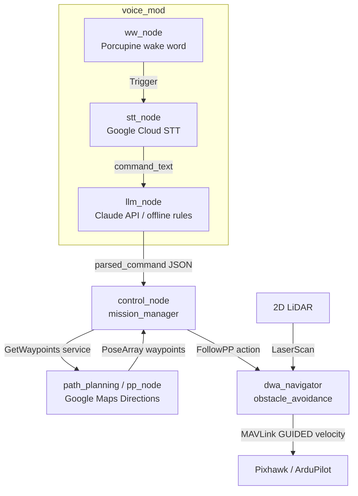

# D-Guide

**A voice-commanded guide drone that plans real street routes and leads you there.**

Tell the drone where you want to go. It geocodes the destination, pulls
walking directions from Google Maps, converts every turn into GPS waypoints,
takes off, and flies the route ahead of you.

<!-- Demo GIF: record a SITL mission (see docs/installation.md) and drop it here -->
<!--  -->

## Hardware

Built on a Holybro X500 V2 quad-frame with a Raspberry Pi companion computer
and a Pixhawk flight controller; 3D-printed mounts carry the LiDAR and camera.


## Features

- **Street-level path planning** — address → Google Maps Directions → GPS waypoint list, exposed as a ROS 2 service
<!-- optional: add a path-planning screenshot here, e.g. docs/images/pathplanning.jpg -->
- **HOLO-DWA obstacle avoidance** — LiDAR-driven reactive flight: each waypoint is flown under closed-loop velocity control, re-planning around obstacles at ~10 Hz ([design](docs/HOLO-DWA.md))
- **Voice pipeline** — Porcupine wake word → Google Cloud STT → command text, wired end-to-end into the mission
- **LLM command parsing** — natural language ("take me to the library") → structured intent via the Claude API, with an offline rule-based fallback
- **Mission orchestration** — control node wires typed/spoken input → path service → avoidance flight action

In progress:

- 🚧 **Hand gesture control** — fly commands via simple hand gestures


## Architecture


The precise node / topic / service wiring (matches the ROS 2 code):



Full node/topic/service reference: [docs/architecture.md](docs/architecture.md)

## Tech Stack

**ROS 2 Humble** (rclpy, custom srv/action interfaces) · **ArduPilot** (Pixhawk,
GUIDED velocity control) · **DroneKit / pymavlink** (MAVLink) · **2D LiDAR**
(`sensor_msgs/LaserScan`) · **NumPy** (vectorized DWA search) · **Google Maps
Platform** (Geocoding + Directions) · **Claude API** (command parsing) ·
**Picovoice Porcupine** (wake word) · **Google Cloud Speech-to-Text** · **Docker**


## Quick Start

### Prerequisites

- Ubuntu 22.04 + [ROS 2 Humble](https://docs.ros.org/en/humble/Installation.html)
- Python 3.10, then `pip install -r requirements.txt`
- A [Google Maps API key](https://console.cloud.google.com/google/maps-apis)
  (Geocoding + Directions enabled)

### 1. Configure secrets

```bash
cp .env.example .env
# edit .env — GOOGLE_MAPS_API_KEY is required; the rest are optional
```

`.env` is gitignored; nothing secret ever enters the repo.

### 2. Point at your flight controller

Edit `.env` — real Pixhawk over USB is `DRONE_CONNECTION=/dev/ttyACM0`; set
`LIDAR_TOPIC` to whatever your 2D laser publishes. Full hardware bring-up
(Raspberry Pi + Pixhawk/ArduPilot + LiDAR wiring, frame check, safety) is in
**[docs/installation.md](docs/installation.md)**. No drone handy? The same
guide has an ArduPilot SITL section to rehearse the whole pipeline on a laptop.

### 3. Build and fly

```bash
cd ros_ws
./bringup.sh
```

`bringup.sh` loads `.env`, builds, starts the path planner + DWA avoidance
flight executor + LLM bridge, then drops you into the control node:

```
Enter origin: Hukou Station
Enter destination: <your destination>
```

The drone arms, takes off, and flies each street waypoint under closed-loop
velocity control — steering around whatever the LiDAR sees — then lands.
(No LiDAR / bring-up test: `FLIGHT_EXECUTOR=simple ./bringup.sh` uses plain
`simple_goto`.)

### 4. Voice commands (optional)

```bash
./voice.sh      # in another terminal, alongside ./bringup.sh
```

Wake word → speech-to-text → destination → flight. Or skip the mic and inject
a command directly:

```bash
ros2 topic pub --once /command_text std_msgs/String \
  "{data: 'take me from Hukou Station to the city library'}"
```

With `ANTHROPIC_API_KEY` set, parsing uses the Claude API; without it an
offline rule-based parser handles the common phrasings.

## Repository Layout

```
├── docs/                 # architecture, installation, HOLO-DWA design
├── docker/               # ROS 2 Humble container for the nav stack
└── ros_ws/
    ├── bringup.sh        # build + launch the mission (flight + brain)
    ├── voice.sh          # microphone front-end (wake word + STT)
    ├── scripts/          # standalone tools (flight smoke test, waypoint CLI)
    └── src/
        ├── interfaces/          # GetWaypoints.srv, FollowPP.action
        ├── path_planning/       # Google Maps → waypoints service
        ├── mission_manager/     # control_node + simple followpp_server
        ├── obstacle_avoidance/  # HOLO-DWA planner + dwa_navigator flight
        └── voice_mod/           # wake word, STT, LLM parsing
```

## Roadmap

- [ ] Record a demo GIF for this README
- [ ] On-drone TTS feedback to the user

## Companion Project

**[HOLO-DWA](https://github.com/blar-tw/HOLO-DWA)** — the holonomic Dynamic
Window Approach planner powering D-Guide's obstacle avoidance, built and tuned
to 15/15 goal-reaching runs with zero collisions (PX4 SITL + Gazebo). Its
`dwa_core.py` is vendored into this repo's `obstacle_avoidance` package; see
[docs/HOLO-DWA.md](docs/HOLO-DWA.md).

## License

[MIT](LICENSE)
