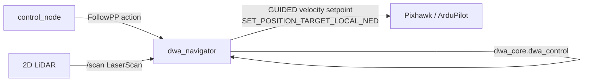

# HOLO-DWA Obstacle Avoidance

D-Guide's obstacle avoidance is **HOLO-DWA** — a holonomic Dynamic Window
Approach planner developed and tuned as a standalone companion project, now
integrated into the flight loop:

> **[blar-tw/HOLO-DWA](https://github.com/blar-tw/HOLO-DWA)** — reactive,
> LiDAR-driven obstacle avoidance for a multirotor. Validated in a repeatable
> experiment harness: **15/15 runs reached the goal with zero collisions** on a
> wall-slalom-gate course (baseline before tuning: 1/5 with 44+ collisions).
> Full tuning study:
> [`holo_lab/EXPERIMENTS.md`](https://github.com/blar-tw/HOLO-DWA/tree/main/holo_lab).

In D-Guide it lives in the `obstacle_avoidance` package: the tuned planner
(`dwa_core.py`, vendored unchanged) plus a flight executor (`dwa_navigator`)
that drives a real ArduPilot drone.

## Why DWA, and why holonomic

The Dynamic Window Approach samples velocities the vehicle can actually reach
within one control cycle (respecting acceleration limits), forward-simulates
each candidate, and scores the trajectories on heading-to-goal, obstacle
clearance, and speed. A multirotor can accelerate in any horizontal direction,
so instead of the classic differential-drive `(v, ω)` window, HOLO-DWA
searches the **`(vx, vy)` velocity space** — the drone can sidestep an
obstacle without yawing.

Key design points inherited from the HOLO-DWA study:

- **Blend velocity reward** — avoids diagonal drift in open areas.
- **Directional clearance probing (1.5 m)** — prevents the "creeping trap"
  near obstacles.
- **Braking-curve goal bonus** — stops the drone orbiting the goal.
- **Frame discipline** — a standard `LaserScan` is left-handed relative to the
  NED/FRD body frame, so its points are mirrored (`LIDAR_FLIP_Y`). Getting this
  wrong sends the drone *into* obstacles; verify with the spin test in
  [installation.md](installation.md).

## How it flies (D-Guide integration)

The `dwa_navigator` node serves the same `follow_waypoints` (FollowPP) action
as the simple flight server, so `control_node` is unchanged. The difference is
what happens per waypoint:

Per waypoint, at ~10 Hz:

1. Convert the GPS waypoint to a **local NED goal** relative to the drone's
   current position (equirectangular; accurate over short street legs).
2. Build an obstacle point cloud from the latest `LaserScan`, rotated into the
   local frame by the drone's heading.
3. `dwa_core.dwa_control(state, goal, obstacles, cfg)` → best `(vx, vy)`.
4. Send it as an **ArduPilot GUIDED velocity command**
   (`SET_POSITION_TARGET_LOCAL_NED`, velocity + yaw, `vz = 0` to hold
   altitude), nose turned toward the goal so the forward LiDAR covers the
   travel direction.
5. Advance to the next waypoint within `tolerance` metres; land after the last.

With no LiDAR data the obstacle set is empty and DWA flies straight to the
goal, so the same node also works as a plain waypoint follower (and in SITL).

## Flight-stack note

D-Guide runs **ArduPilot + DroneKit/MAVLink** (matching the Raspberry-Pi
deployment), so `dwa_navigator` commands velocity via MAVLink GUIDED. The
companion HOLO-DWA repo drives the *same* `dwa_core` planner through **PX4
offboard + uXRCE-DDS** in SITL — the planner is flight-stack-agnostic; only the
thin command/telemetry layer differs.

## Status

| Piece | Status |
|---|---|
| DWA core algorithm (`dwa_core.py`) | ✅ Implemented and tuned (vendored from HOLO-DWA) |
| Flight executor (`dwa_navigator`, DroneKit GUIDED) | ✅ Implemented |
| Experiment harness + results | ✅ 15/15 runs, 0 collisions (companion repo, SITL) |
| Real-drone flight tuning | 🟡 Verify `LIDAR_FLIP_Y`, `ROBOT_RADIUS`, speeds on your airframe |
