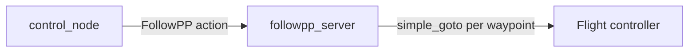
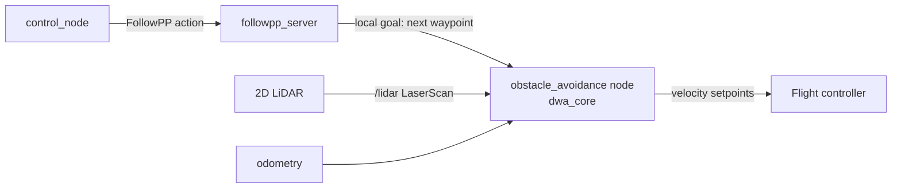

# HOLO-DWA Obstacle Avoidance — Integration Design

D-Guide currently flies waypoint-to-waypoint with no awareness of obstacles
between waypoints. The avoidance layer for this is **HOLO-DWA** — a holonomic
Dynamic Window Approach planner developed as a standalone companion project:

> **[blar-tw/HOLO-DWA](https://github.com/blar-tw/HOLO-DWA)** — reactive,
> LiDAR-driven obstacle avoidance for a simulated multirotor (PX4 SITL +
> Gazebo). Validated in a repeatable experiment harness: **15/15 runs reached
> the goal with zero collisions** on a wall-slalom-gate obstacle course
> (baseline before tuning: 1/5 with 44+ collisions). The full tuning study is
> in its [`holo_lab/EXPERIMENTS.md`](https://github.com/blar-tw/HOLO-DWA/tree/main/holo_lab).

The algorithm itself is implemented and validated; **its integration into
D-Guide is planned** and designed below.

## Why DWA, and why holonomic

The Dynamic Window Approach samples velocities the vehicle can actually reach
within one control cycle (respecting acceleration limits), forward-simulates
each candidate, and scores the trajectories on heading-to-goal, obstacle
clearance, and speed. A multirotor can accelerate in any horizontal direction,
so instead of the classic differential-drive `(v, ω)` window, HOLO-DWA
searches the **`(vx, vy)` velocity space** — the drone can sidestep an
obstacle without yawing.

Key design points inherited from the HOLO-DWA study:

- **Blend velocity reward** — avoids diagonal drift in open areas.
- **Directional clearance probing (1.5 m)** — prevents the "creeping trap"
  near obstacles.
- **Braking-curve goal bonus** — stops the drone orbiting the goal.
- **Frame discipline** — Gazebo FLU vs PX4 FRD mirroring was the root cause
  of early failures; any integration must be explicit about frames.

## Where it fits in D-Guide

Today's mission flow commands the flight controller directly per waypoint:

With avoidance, the waypoint becomes a *local goal* for the DWA layer, which
owns the velocity commands:

## Planned integration steps

1. **New package `ros_ws/src/obstacle_avoidance`** vendoring
   [`dwa_core.py`](https://github.com/blar-tw/HOLO-DWA/blob/main/dwa_core.py)
   (pure Python, no ROS deps — imports cleanly).
2. **Node `dwa_node`**: subscribes `LaserScan` + odometry, exposes a
   `set_local_goal` interface (topic or service) fed by `followpp_server`,
   publishes velocity setpoints at 20 Hz.
3. **Flight-stack bridge** — the open design decision:
   - *HOLO-DWA native path*: PX4 offboard via uXRCE-DDS
     (`/fmu/in/trajectory_setpoint`), exactly as the companion repo already
     does. Requires D-Guide's SITL demo to run PX4 instead of ArduPilot.
   - *D-Guide native path*: ArduPilot GUIDED velocity commands via
     MAVLink (`SET_POSITION_TARGET_LOCAL_NED` through dronekit/pymavlink).
     Keeps the current DroneKit stack; needs a thin adapter mapping
     `dwa_core` output to MAVLink velocity setpoints.
4. **`followpp_server` change**: instead of `simple_goto(waypoint)`, publish
   the waypoint as the DWA local goal and monitor progress; keep the existing
   action feedback (`current_index`, `distance_to_goal`) unchanged.
5. **Validation**: port the `holo_lab` experiment harness scenario (wall →
   slalom → gate) into the D-Guide SITL setup and require the same bar —
   repeated runs, zero collisions — before flying it on hardware.

## Status

| Piece | Status |
|---|---|
| DWA core algorithm (`dwa_core.py`) | ✅ Implemented and tuned ([HOLO-DWA](https://github.com/blar-tw/HOLO-DWA)) |
| Live PX4 SITL avoidance node (`scanner.py`) | ✅ Implemented in the companion repo |
| Experiment harness + results | ✅ 15/15 runs, 0 collisions |
| `obstacle_avoidance` package in D-Guide | 📋 Planned (steps above) |
| LiDAR on the physical drone | 📋 Planned (hardware) |
