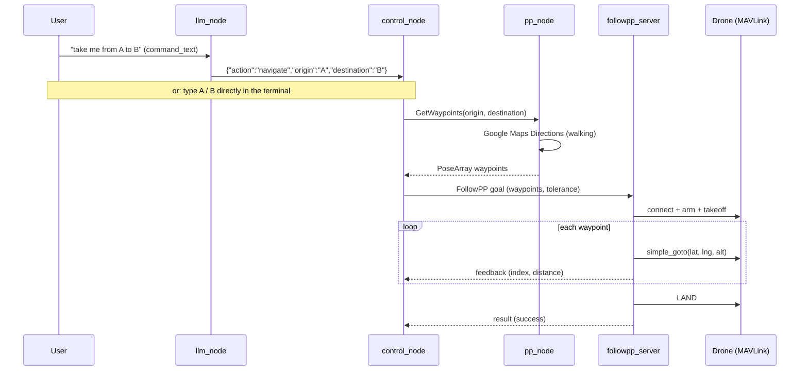

# Architecture

How a spoken or typed destination becomes a flown route.

## Nodes

| Node | Package | Executable | Role |
|---|---|---|---|
| `path_planner_service` | `path_planning` | `pp_node` | Geocodes and requests walking directions from Google Maps; converts each step's end location into a waypoint |
| `control_node` | `mission_manager` | `control_node` | Mission orchestrator: takes commands (terminal or `parsed_command`), calls the path service, dispatches the flight action |
| `followpp_server` | `mission_manager` | `followpp_server` | Flies the waypoint list via DroneKit/MAVLink: arm → takeoff → `simple_goto` each waypoint → land |
| `llm_command_parser` | `voice_mod` | `llm_node` | Natural language → structured navigation intent (Claude API, offline rule fallback) |
| `wake_word_node` | `voice_mod` | `ww_node_service` / `ww_node_topic` | Porcupine wake-word detection (🟡 not yet wired into the mission flow) |

## Interfaces

### Service — `interfaces/srv/GetWaypoints`

Served on `get_waypoints` by `pp_node`.

```
string origin
string destination
---
geometry_msgs/PoseArray waypoints   # position.x = lat, position.y = lng
```

### Action — `interfaces/action/FollowPP`

Served on `follow_waypoints` by `followpp_server`.

```
# Goal
geometry_msgs/PoseStamped[] waypoints
float32 tolerance                    # meters to consider a waypoint reached
---
# Result
bool success
int32 last_reached_index
string message
---
# Feedback
int32 current_index
float64 distance_to_goal             # meters to current waypoint
```

### Topics

| Topic | Type | Publisher → Subscriber | Content |
|---|---|---|---|
| `command_text` | `std_msgs/String` | (you / STT) → `llm_node` | Raw natural-language command |
| `parsed_command` | `std_msgs/String` | `llm_node` → `control_node` | JSON intent: `{"action", "origin", "destination", "message"}` |
| `wake_detected` | `std_msgs/Empty` | `ww_node_topic` → (STT, 🟡) | Wake-word fired |

## Mission sequence



## Configuration

All runtime configuration comes from environment variables, loaded from the
repo-root `.env` by `bringup.sh` (see `.env.example` for the full list):

| Variable | Used by | Purpose |
|---|---|---|
| `GOOGLE_MAPS_API_KEY` | `pp_node`, `scripts/waypoints_cli.py` | Directions + Geocoding |
| `DRONE_CONNECTION`, `DRONE_BAUD` | `followpp_server`, `scripts/flight_test.py` | SITL vs real Pixhawk |
| `CRUISE_ALTITUDE` | `followpp_server` | Takeoff / cruise altitude (m) |
| `ANTHROPIC_API_KEY`, `LLM_MODEL`, `DEFAULT_ORIGIN` | `llm_node` | Claude parsing (optional) |
| `PICOVOICE_ACCESS_KEY`, `PVRECORDER_DEVICE_INDEX`, `WW_MODEL_PATH` | wake-word nodes | Porcupine |
| `GOOGLE_APPLICATION_CREDENTIALS` | STT | Google Cloud Speech |

## Design notes

- **Service vs action split**: path planning is a quick request/response
  (service); flight is long-running with progress and cancellation (action).
- **Waypoint encoding**: GPS coordinates ride in `PoseArray` /
  `PoseStamped` with `position.x = latitude`, `position.y = longitude`;
  altitude is a mission-level setting (`CRUISE_ALTITUDE`), not per-waypoint.
- **Cancellation**: `FollowPP` handles client cancel requests mid-flight by
  switching the vehicle to LAND.
- **Obstacle avoidance** is deliberately out of this loop today; the planned
  HOLO-DWA layer slots between `followpp_server` and the flight controller —
  see [HOLO-DWA.md](HOLO-DWA.md).
