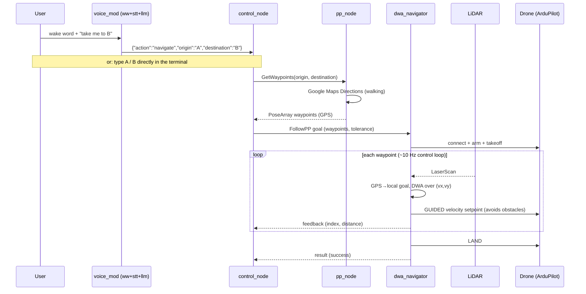

# Architecture

How a spoken or typed destination becomes a flown route.

## Nodes

| Node | Package | Executable | Role |
|---|---|---|---|
| `path_planner_service` | `path_planning` | `pp_node` | Geocodes and requests walking directions from Google Maps; converts each step's end location into a waypoint |
| `control_node` | `mission_manager` | `control_node` | Mission orchestrator: takes commands (terminal or `parsed_command`), calls the path service, dispatches the flight action |
| `dwa_navigator` | `obstacle_avoidance` | `dwa_navigator` | **Avoidance flight executor** (demo default): flies each waypoint under closed-loop velocity control, re-planning around the live LiDAR scan; arm → takeoff → DWA-follow → land |
| `followpp_server` | `mission_manager` | `followpp_server` | Simple flight executor (fallback): arm → takeoff → `simple_goto` each waypoint → land. No avoidance |
| `llm_command_parser` | `voice_mod` | `llm_node` | Natural language → structured navigation intent (Claude API, offline rule fallback) |
| `stt_node` | `voice_mod` | `stt_node` | `process_voice_command` service: record mic → Google Cloud STT → publish `command_text` |
| `wake_word_node` | `voice_mod` | `ww_node_service` / `ww_node_topic` | Porcupine wake-word detection; the `_service` variant calls `process_voice_command` |

`dwa_navigator` and `followpp_server` both serve the same `follow_waypoints`
action — run exactly one (selected by `FLIGHT_EXECUTOR` in `bringup.sh`).

## Interfaces

### Service — `interfaces/srv/GetWaypoints`

Served on `get_waypoints` by `pp_node`.

```
string origin
string destination
---
geometry_msgs/PoseArray waypoints   # position.x = lat, position.y = lng
```

### Action — `interfaces/action/FollowPP`

Served on `follow_waypoints` by `dwa_navigator` (or `followpp_server`).

```
# Goal
geometry_msgs/PoseStamped[] waypoints
float32 tolerance                    # meters to consider a waypoint reached
---
# Result
bool success
int32 last_reached_index
string message
---
# Feedback
int32 current_index
float64 distance_to_goal             # meters to current waypoint
```

### Topics

| Topic | Type | Publisher → Subscriber | Content |
|---|---|---|---|
| `command_text` | `std_msgs/String` | `stt_node` (or you) → `llm_node` | Raw natural-language command |
| `parsed_command` | `std_msgs/String` | `llm_node` → `control_node` | JSON intent: `{"action", "origin", "destination", "message"}` |
| `<LIDAR_TOPIC>` (e.g. `/scan`) | `sensor_msgs/LaserScan` | LiDAR driver → `dwa_navigator` | 2D obstacle scan |

The wake-word `_service` node calls the `process_voice_command` (`std_srvs/Trigger`)
service provided by `stt_node`, which records and transcribes on demand.

## Mission sequence



## Configuration

All runtime configuration comes from environment variables, loaded from the
repo-root `.env` by `bringup.sh` (see `.env.example` for the full list):

| Variable | Used by | Purpose |
|---|---|---|
| `GOOGLE_MAPS_API_KEY` | `pp_node`, `scripts/waypoints_cli.py` | Directions + Geocoding |
| `DRONE_CONNECTION`, `DRONE_BAUD` | flight executors, `scripts/flight_test.py` | Pixhawk link (real / SITL) |
| `CRUISE_ALTITUDE`, `NAV_SPEED_MAX` | flight executors | Cruise altitude (m), max speed (m/s) |
| `LIDAR_TOPIC`, `LIDAR_FLIP_Y`, `ROBOT_RADIUS`, `LIDAR_STRIDE` | `dwa_navigator` | Avoidance sensor + planner tuning |
| `ANTHROPIC_API_KEY`, `LLM_MODEL`, `DEFAULT_ORIGIN` | `llm_node` | Claude parsing (optional) |
| `PICOVOICE_ACCESS_KEY`, `PVRECORDER_DEVICE_INDEX`, `WW_MODEL_PATH` | wake-word nodes | Porcupine |
| `GOOGLE_APPLICATION_CREDENTIALS`, `STT_LANGUAGE`, `STT_RECORD_SECONDS`, `MIC_DEVICE_INDEX` | `stt_node` | Google Cloud Speech |

See [installation.md](installation.md) for the real-hardware bring-up.

## Design notes

- **Service vs action split**: path planning is a quick request/response
  (service); flight is long-running with progress and cancellation (action).
- **Waypoint encoding**: GPS coordinates ride in `PoseArray` /
  `PoseStamped` with `position.x = latitude`, `position.y = longitude`;
  altitude is a mission-level setting (`CRUISE_ALTITUDE`), not per-waypoint.
- **Obstacle avoidance in the loop**: `dwa_navigator` doesn't just go to a
  waypoint — it converts each GPS waypoint to a local NED goal and runs the
  HOLO-DWA planner over the `(vx, vy)` window every tick, commanding ArduPilot
  GUIDED velocity so the drone steers around obstacles the LiDAR sees. With no
  scan it flies straight. See [HOLO-DWA.md](HOLO-DWA.md).
- **Cancellation**: `FollowPP` handles client cancel requests mid-flight by
  zeroing velocity and switching the vehicle to LAND.
- **Flight-stack agnostic planner**: `dwa_core.py` is pure NumPy; the same
  planner runs on PX4 offboard in the companion HOLO-DWA repo and on ArduPilot
  GUIDED here — only the thin command/telemetry layer differs.
